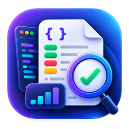

# QA Evidence Builder



QA Evidence Builder is a local desktop tool for QA, Testers, and Developers to turn API/network logs into focused evidence for defects, tickets, and technical investigation.

## Version

**v1.3.4**

## Key features

- Import Elasticsearch/Kibana-style single JSON objects and JSON arrays
- Import HAR network logs
- Import and merge multiple JSON/HAR files with source tracking
- Paste JSON directly into the application
- Timeline view with API, status, response time, request ID, transaction, and error fingerprint
- Search and filtering by method, status, page, Kafka topic, transaction, errors, and slow APIs
- Collapsible categorized filters, removable filter chips, presets, and resizable timeline columns
- Explicit log selection with Include/Exclude, Select All, and Deselect All
- Transaction grouping
- Transaction journey summaries with first error, slowest API, and duration
- Transaction ID source and fallback indication
- Import validation summary for skipped records and incomplete fields
- Expected Result / Actual Result evidence
- Sensitive-data masking and custom mask keys
- Plain-text and Markdown ticket evidence
- Evidence folder export grouped by Kafka topic, page name, page URL, or a custom folder
- Configurable export-folder naming with `Log_{date}_{time}` as the default
- Optional ZIP archive (off by default)
- Explicit warning and confirmation before raw-log export
- Error fingerprinting and repeated-error analysis
- HTTP-200 business-error detection with configurable success result codes
- Configurable slow-API threshold
- Per-log evidence notes
- Built-in Help / User Guide
- Modern custom-styled PySide6 dashboard with persistent Dark/Light mode, responsive navigation, and inspector
- Branded Windows and macOS application icons and metadata

## Requirements

- Python 3.10–3.13 (the pinned PySide6 runtime does not support Python 3.14)
- Dependencies from `requirements.txt` (including PySide6)

## Run locally

```bash
python3 -m venv .venv
source .venv/bin/activate
python -m pip install -r requirements.txt
python run.py
```

On Windows, activate the virtual environment with:

```powershell
.venv\Scripts\activate
python -m pip install -r requirements.txt
python run.py
```

## Basic workflow

1. Import a JSON Array or HAR file.
2. Filter/search for relevant API logs.
3. Select the required rows.
4. Include selected logs, or use Select All for the current filtered result.
5. Review Evidence and optionally enter Expected/Actual results.
6. Keep sensitive-data masking enabled.
7. Copy the evidence for a ticket or export an evidence folder, with an optional ZIP archive.

## Security

The application is designed to work locally. Logs may contain tokens, authorization headers, session identifiers, customer information, and other sensitive data. Review evidence before sharing it and prefer sanitized exports.

Raw log export is disabled by default.

## Checks

```bash
python -m compileall -q src run.py tests
python tests/test_core.py
python tests/test_help.py
python tests/test_help_visibility.py
python tests/test_ui_source.py
python tests/test_ui_smoke.py
python tests/test_release_workflow.py
```

Tests are deliberately runnable without a display server; packaged UI smoke checks run in CI.

## Repository

GitHub: [`jiratin/qa-evidence-builder`](https://github.com/jiratin/qa-evidence-builder)

## Release

Initial public release: **v1.0.0**

## Download ready-to-run builds

Prebuilt binaries are published under **GitHub Releases**.

### macOS

Choose the package that matches your Mac:

- **Apple Silicon (M1 / M2 / M3 / M4 and newer):** `QA-Evidence-Builder-macOS-Apple-Silicon.zip`
- **Intel Mac:** `QA-Evidence-Builder-macOS-Intel.zip`

Extract the ZIP, then open `QA Evidence Builder.app`.

### Windows

- Download `QA-Evidence-Builder-Windows.exe`
- Run the executable directly.

Users of these release builds do not need VS Code or a separate Python installation.

> macOS and Windows builds are currently unsigned. Gatekeeper or SmartScreen may display a warning until code signing is configured.

## Automated releases

GitHub Actions builds both operating-system versions whenever a version tag such as `v1.0.1` is pushed.

See [`docs/RELEASING.md`](docs/RELEASING.md) for the release process and manual rebuild instructions.

## Development documentation

- [`docs/PROJECT_CONTEXT.md`](docs/PROJECT_CONTEXT.md) — current status, constraints, and continuation checklist
- [`docs/ROADMAP.md`](docs/ROADMAP.md) — delivered, partial, planned, and deferred work
- [`docs/REQUIREMENTS.md`](docs/REQUIREMENTS.md) — compatibility contract and verification map
- [`docs/ARCHITECTURE.md`](docs/ARCHITECTURE.md) — module boundaries and data flow
- [`docs/DECISIONS.md`](docs/DECISIONS.md) — decisions that should not be reversed accidentally
- [`docs/RELEASING.md`](docs/RELEASING.md) — versioning, validation, packaging, and release procedure

## Changelog

See [`CHANGELOG.md`](CHANGELOG.md).
